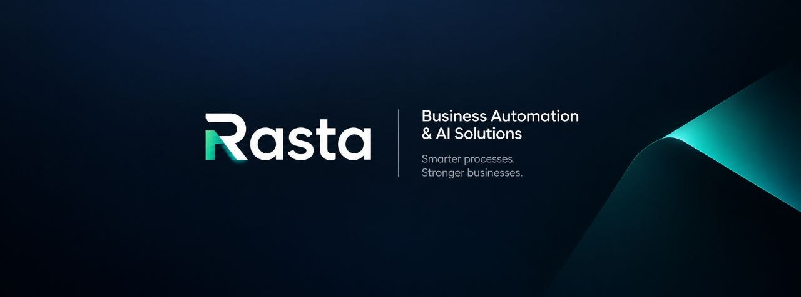

<h1 align="left">Hi, I'm Reza 👋</h1>

An AI Automation Developer from Iran 🤖

<h1 align="center">Hi 👋, I'm Reza</h1>
<h3 align="center">🇬🇧 An AI automation developer from Iran.</h3>

alt="reezanikeghbal-design" /> 

- 🔭 I’m currently working on **AI Automation**

- 🌱 I’m currently learning **API integrations, and connecting different tools and systems to build reliable automated workflows**

- 👯 I’m looking to collaborate on **Sharivar**

- 🤝 I’m looking for help with **AI Automation**

- 💬 Ask me about **Programming fundamentals, machine learning, and artificial intelligence**

- 📫 How to reach me **reezanikeghbal@gmail.com**

- 📄 Know about my experiences [Problem solving, automation, and finding practical solutions to difficult problems](Problem solving, automation, and finding practical solutions to difficult problems)

- ⚡ Fun fact **I grew up in Iran, so problem-solving became a survival skill. 😅🇮🇷**

<h3 align="left">Connect with me:</h3>

<h3 align="left">Languages and Tools:</h3>

              

&nbsp;

